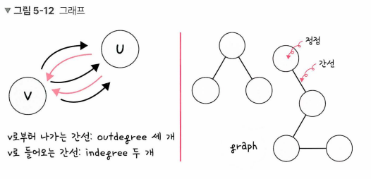

__비선형 자료 구조__
===
- 일렬로 나열하지 않고 자료 순서나 관계가 복잡한 구조
- 일반적으로 트리나 그래프

## __그래프__
- 정점과 간선으로 이루어진 자료 구조

### __정점과 간선__
- 정점(vertex) : 그래프의 각 점을 의미
- 간선(edge) : 정점들을 연결하는 선
- 어떠한 곳에서 어떠한 곳으로 무언가를 통해 간다고 했을때 '어떠한 곳'은 정점(vertex)이 되고 '무언가'는 간선(edge)이 된다.

### __간선의 종류__
- 단방향 간선
	- 어떠한 곳에서 어떠한 곳으로 한쪽으로만 연결되어 있는 것
- 양방향 간선
	- 어떠한 곳에서 어떠한 곳으로 서로 연결되어 있는 것

- - -

### __정점의 연결 상태__
- 정점으로 나가는 간선을 해당 정점의 outdegree
- 들어오는 간선을 해당 정점의 indegree
- 정점은 약자로 V 또는 U 라고 한다.
- 보통 정점으로부터 시작해서 어떤 정점까지 간다를 "U에서부터 V로 간다"라고 표현

### __그래프의 구성__
- 정점과 간선으로 이루어진 집합을 그래프라고 한다.

### __가중치__
- 간선과 정점 사이에 드는 비용
- 1번 노드와 2번 노드까지 가능 비용이 한 칸이라면 1번 노드에서 2번 노드까지의 가중치는 한 칸