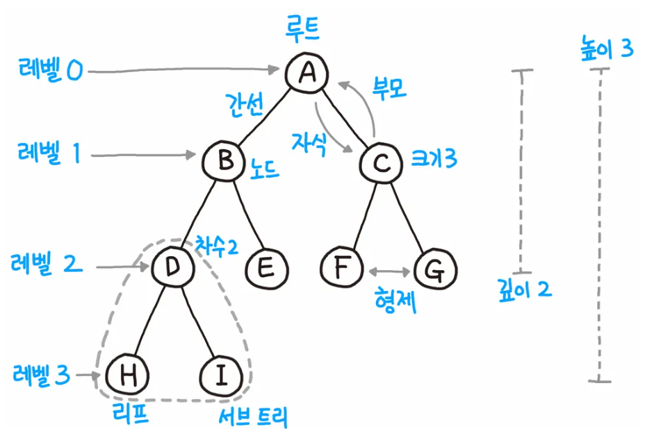
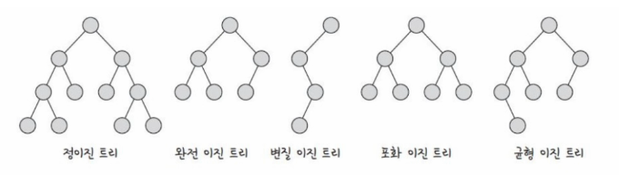
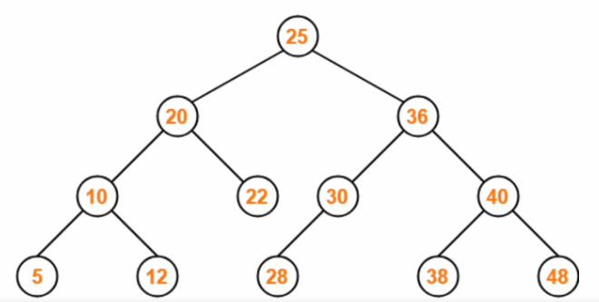
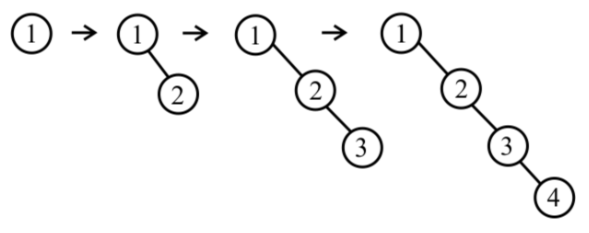
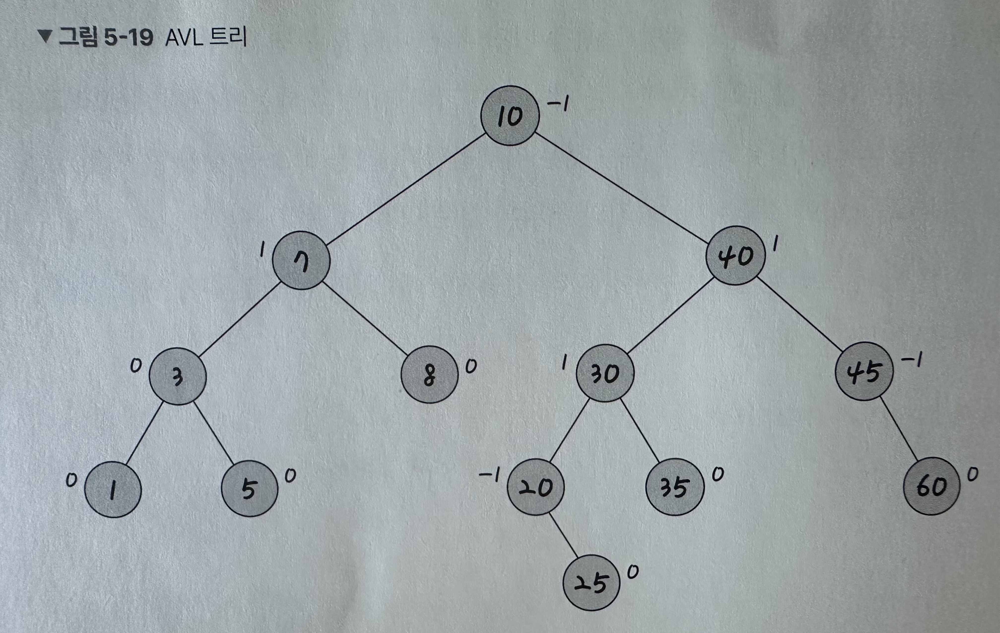
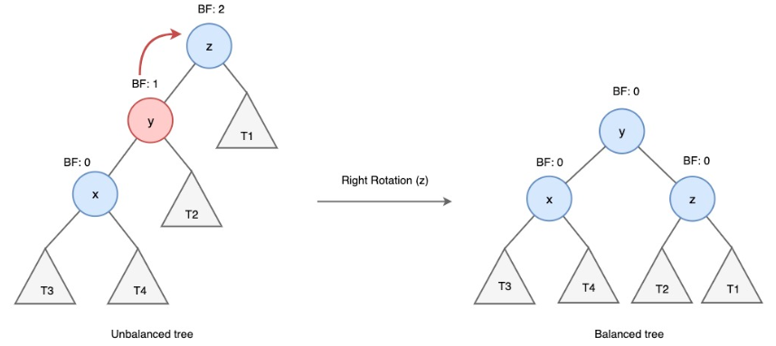
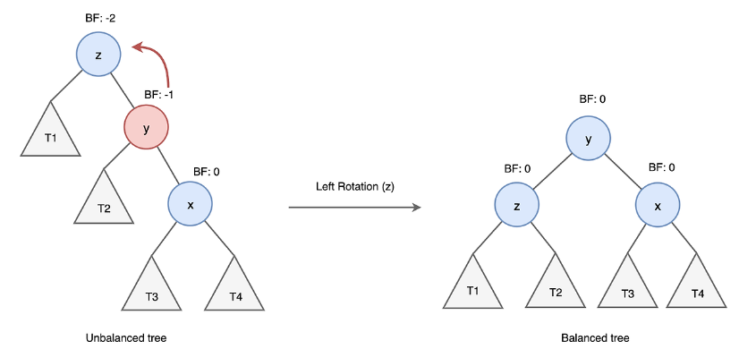
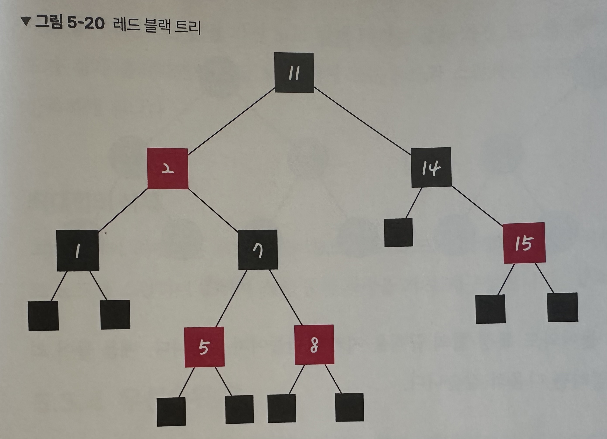

# 트리

트리는 그래프 중 하나로 그래프의 특징처럼 정점과 간선으로 이루어져 있고, 트리 구조로 배열된 일종의 계층적 데이터의 집합입니다. 트리로 이루어진 집합을 숲이라고 합니다.

## 트리의 특징

-   부모-자식 관계로 정의하고, 부모에서 자식으로 간선이 이어져 있는 방향 그래프입니다.
-   트리에서 부모가 없는 노드를 부모 노드라고 합니다.
-   임의의 두 노드 사이의 경로는 '유일무이'하게 '존재'합니다. 즉, 트리 내의 어떤 노드와 어떤 노드까지의 경로는 반드시 있습니다.
-   V - 1 = E라는 특징이 있습니다. 간선 수는 노드 수 - 1 입니다.

## 트리의 구성

트리는 루트노드, 내부노드, 리프노드로 이루어져 있습니다.

루트 노드: 가장 위에 있는 노드입니다. ( 트리에서 부모가 없는 최상위 노드, 트리의 시작점 )  
내부 노드: 루트 노드와 내부 노드 사이에 있는 노드를 뜻합니다.  
리프 노드: 자식 노드가 없는 노드를 뜻합니다.

부모 노드: 루트 노드 방향으로 직접 연견된 노드  
자식 노드: 루트 노드와 반대 방향으로 직접 연결된 노드  
형제 노드: 같은 부모 노드를 갖는 노드들

높이: 트리의 높이는 루트 노드부터 리프 노드까지 거리중 가장 긴 거리를 의미합니다. 이 그림에서는 높이가 3입니다.  
깊이: 깊이는 각 노드마다 다르며, 루트 노드부터 특정 노드까지 최단 거리로 갔을 때의 거리를 말합니다. 이 그림에서 D노드의 깊이는 2입니다.  
레벨: 트리의 레벨은 주어지는 문제마다 조금씩 다르지만 보통 깊이와 같은 의미를 지닙니다. A노드를 0레벨이라고 하면 B와 C노드는 1레벨이 됩니다.

서브트리: 트리 내의 하위 집합을 서브트리라고 합니다. 즉, 트리 내에 있는 부분집합이라고도 보면 됩니다.

## 이진트리

이진 트리는 자식의 노드 수가 두 개 이하인 트리를 의미합니다.

-   정이진트리(full binary tree): 자식 노드가 0 또는 두개인 이진트리
-   완전 이진 트리(complete binary tree): 왼쪽에서부터 채워져 있는 이진트리, 마지막 레벨을 제외하고는 모든 레벨이 완전히 채워져 있으며, 마지막 레벨의 경우 왼쪽부터 채워져있음
-   변질 이진 트리(degenerate binary tree): 자식 노드가 하나밖에 없는 이진 트리
-   포화 이진 트리(perfect binary tree): 모든 노드가 꽉 차있는 이진트리
-   균형 이진 트리(balanced binary tree): 왼쪽과 오른쪽 노드의 높이 차이가 1 이하인 이진 트리, map, set을 구성하는 레드-블랙 트리가 규형 이진 트리 중 하나

## 이진 탐색 트리

이진 탐색 트리는 노드의 오른쪽 하위 트리에는 '노드 값보다 큰 값'이 있는 모드만 포함되고, 왼쪽 하위 트리에는 '노드 값보다 작은 값'이 들어 있는 트리를 말합니다.

보통 요소를 찾을 때 이진 탐색 트리의 경우 O(logn)이 걸리고 최악의 경우 O(n)이 걸립니다.

삽입 순서: 25, 20, 22, 36, 30, 40, 10, 28, 38, 48, 12, 5

### 최악의 이진 탐색 트리

삽입 순서: 1, 2, 3, 4

## AVL 트리

AVL 트리(Adelson-Velsky and Landis tree)는 앞서 설명한 최악의 경우 선형적인 트리가 되는 것을 방지하고 스스로 균형을 잡는 이진 탐색 트리입니다. 두 자식 서브트리의 높이는 항상 최대 1 만큼 차이 난다는 특징이 있습니다.

이진 탐색 트리는 선형적인 트리 형태를 가질 때 최악의 경우 O(n)의 시간 복잡도를 갖기 때문에 이러한 최악의 경우를 배제하고 항상 균형 잡힌 트리를 만들기 위해 AVL 트리가 생겼습니다.
AVL트리는 탐색, 삽입, 삭제 모두 시간 복잡도가 O(logn)입니다.
만약 균형이 맞지 않는다면 트리의 일부를 왼쪽 혹은 오른쪽으로 회전시키며 균형을 잡습니다.

LL(Left Left) case

RR(Right Right) case

 

## 레드 블랙 트리

레드-블랙 트리는 균형 이진 탐색 트리로 탐색, 삽입, 삭제 모두 시간 복잡도가 O(logn)입니다. 각 노드는 빨간색 또는 검은색의 색상을 추가 비트로 저장하며, 삽입 및 삭제 중에 트리가 균형을 유지하도록 하는데 사용됩니다.

'모든 리프 노드와 루트 노드는 블랙이고 어떤 노드가 레드이면 그 노드의 자식은 반드시 블랙이다' 등의 규칙을 기반으로 균형을 잡는 트리입니다.

특징

-   모든 노드는 레드 아니면 블랙이다.
-   루트 노드는 블랙이다.
-   레드 노드는 레드 노드를 자식으로 가질 수 없다.
-   모든 레드 노드의 부모는 블랙이다.
-   레드 노드는 연속으로 존재할 수 없다.

레드-블랙 트리는 삽입과 삭제 시의 균형을 맞추기 위한 연산의 수가 AVL 트리에 비해 적기 때문에, 삽입과 삭제 연산이 빈번한 환경에서 더 적합합니다. 반면 AVL 트리는 더 엄격하게 균형을 유지하기 때문에 탐색 성능이 조금 더 우수합니다.
