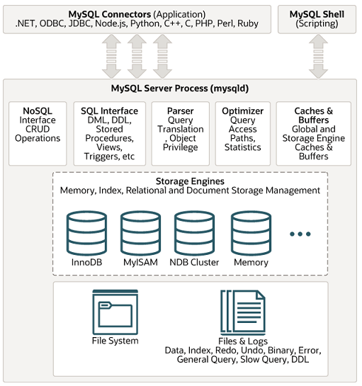

# 데이터베이스의 종류

## 관계형 데이터베이스

관계형 데이터베이스(RDBMS)

-   행과 열을 가지는 표 형식 데이터를 저장하는 형태의 데이터베이스를 가리키며 SQL이라는 언어를 사용합니다.
-   종류: MySQL, PostgreSQL, 오라클, SQL Server, MSSSQL 등

### MySQL

-   MySQL은 대부분의 운영체제와 호환되며 현재 가장 많이 사용하는 데이터베이스
-   C, C++로 만들어졌으며 MyISAM 인덱스 압축 기술, B- 트리 기반의 인덱스, 스레드 기반의 메모리 할당 시스템, 매우 빠른 조인, 최대 64개의 인덱스를 제공
-   대용량 데이터베이스를 위해 설계되어 있고 롤백, 커밋, 이중 암호 지원 보안 등의 기능을 제공하며, 많은 서비스에서 사용됨

#### MySQL 스토리 엔진 아키텍처

스토리 엔진: 데이터베이스 관리 시스템이 데이터베이스에 대해 데이터를 삽입, 추출, 업데이트 및 삭제하는 데 사용하는 기본 소프트웨어 컴포넌트입니다. 데이터베이스의 심장과도 같은 역할을 하는 곳 입니다.

MySQL 스토리 엔진 아키텍처
 

 
모듈식 아키텍처로 쉽게 스토리지 엔진을 바꿀 수 있으며 데이터 웨어하우징, 트랜잭션 처리, 고가용성 처리에 강점을 두고 있습니다. 스토리지 엔진 위에는 커넥터 API 및 서비스 계층을 통해 MySQL 데이터베이스와 쉽게 상호작용할 수 있습니다. 또한 MySQL은 쿼리 캐시를 지원해서 입력된 쿼리 문에 대한 전체 결과 집합을 저장하기 때문에 사용자가 작성한 쿼리가 캐시에 있는 쿼리와 동일하면 서버는 단순히 구문 분석, 최적화 및 실행을 건너뛰고 캐시의 출력만 표시합니다.

#### PostgreSQL

PostgreSQL은 MySQL 다음으로 개발자들이 선호하는 데이터베이스 기술로 널리 인정받고 있습니다.

-   디스크 조각이 차지하는 영역을 회수할 수 있는 장치인 VACUUM이 특징
-   최대 테이블의 크기 32TB이며 SQL뿐만 아니라 JSON을 이용해서 데이터에 접근할 수 있음
-   지정 시간에 복구하는 기능, 로깅, 접근제어, 중첩된 트랜잭션, 백업 등을 할 수 있음

 

## 비관계형 데이터베이스

비관계형 테이터베이스는 NoSQL(Not only SQL)이라는 슬로건에서 생겨난 데이터베이스입니다.

-   SQL을 사용하지 않는 데이터베이스
-   Key-Value 형식으로 저장함
-   스키마에 대한 정의가 없음
-   종류: MongoDB, redis 등이 있습니다.

### MongoDB

MongoDB: JSON을 통해 데이터에 접근할 수 있고, Binary JSON 형태(BSON)로 데이터가 저장되며 와이어드타이거 엔진이 기본 스토리지 엔진으로 장착된 키-값 데이터 모델에서 확장된 다큐먼트 기반의 데이터베이스입니다.

-   확장성이 뛰어나고 빅데이터를 저장할 때 성능이 좋고 고가용성과 샤딩, 레플리카셋을 지원
-   스키마를 정해 놓지 않고 데이터를 삽입할 수 있기 때문에 다양한 도메인의 데이터베이스를 기반으로 분석하거나 로깅 등을 구현할 때 강점
-   다큐먼트를 생성할 떄마다 다른 컬렉션에서 중복된 값을 지니기 힘든 유니크한 값이 ObjectID가 생성됨

### redis

redis: 인메모리 데이터베이스이자 키-값 데이터 모델 기반의 데이터베이스

-   기본적인 데이터 타입은 문자열이며 최대 512MB까지 저장할 수 있음
-   셋(set), 해시(hash) 등을 지원
-   pub/sub 기능을 통해 채팅 시스템, 다른 데이터베이스 앞단에 두어 사용하는 캐싱 계층, 단순한 키-값이 필요한 세션 정보 관리, 정렬된 셋(sorted set) 자료 구조를 이용한 실시간 순위표 서비스에 사용

## 관계형 데이터베이스와 비관계형 데이터베이스의 차이점

#### 구조적 차이

관계형 데이터베이스는 데이터를 테이블 형식으로 저장하며 데이터 변형 및 테이블 관계에 관한 엄격한 규칙을 따릅니다. 따라서 데이터 무결성과 일관성을 유지하면서 정형 데이터에 대한 복잡한 쿼리를 처리할 수 있습니다.

비관계형 데이터베이스는 더 유연하며, 요구 사항이 변화하는 데이터에 유용합니다. 따라서 이미지, 비디오, 문서 및 기타 반정형 및 비정형 콘텐츠를 저장하는 데 사용할 수 있습니다.

#### 데이터 무결성

데이터의 무결성은 데이터의 정확성, 일관성, 유효성이 유지되는 것을 말합니다.
관계형 데이터베이스 모델의 트랜잭션에는 4가지 속성이 있는데 원자성, 일관성, 격리, 내구성입니다. 따라서 관계형 데이터베이스는 데이터에 대한 모든 변경이 마치 하나의 작업처럼 수행하여 항상 데이터의 정확성이 보장됩니다.

비관계형 데이터베이스는 기본적으로 가용성이 보장되고 소프트 상태이며 궁극적으로 일관된(BASE) 보다 유연한 모델을 제공합니다.

#### 확장성

관계형 데이터베이스는 엄격한 스키마로 인해 확장성이 떨어집니다. 하지만 비관계형 데이터베이스는 스키마에 대한 정의가 없기 때문에 확장성이 뛰어납니다.
