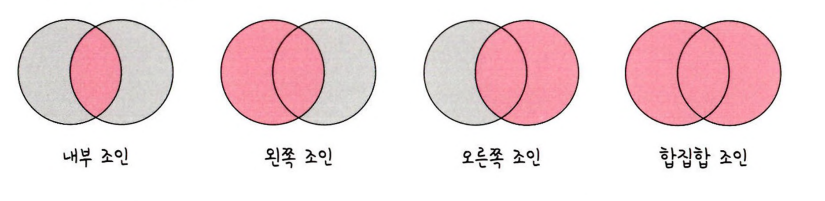

__조인의 종류__
===
- 하나의 테이블이 아닌 두 개 이상의 테이블을 묶어서 하나의 결과물을 만드는 방법
    - 예를 들어 친구 목록과 전화번호 목록이 있다면, 이 두개를 합쳐서 친구 이름과 전화번호를 보여줄 수 있다.
- MySQL은 JOIN이라는 쿼리, MongoDB는 lookup이라는 쿼리로 처리 가능
- MongoDB는 lookup은 되도록 사용하지 말아야한다.(관계형 DB보다 성능이 떨어진다.)
- 조인 작업이 많은 경우 관계형 데이터베이스를 사용해야한다.


- - -
## __내부 조인 (Inner Join)__
- 두 테이블 간에 교집합(일치하는 데이터)을 나타낸다.
- 친구 목록과 전화번호 목록에서, 전화번호가 있는 친구만 보여줌.
```sql
SELECT * FROM 테이블A A
INNER JOIN 테이블B B ON
A.key = B.key
```
---
## __왼쪽 조인 (Left Outer Join)__
- 왼쪽 테이블의 모든 데이터를 보여주고, 오른쪽 테이블과 일치하는 데이터가 없으면 그 자리에 빈 값(null)을 넣는다.
- 친구 목록을 모두 보여주고, 전화번호가 없는 친구는 전화번호 자리를 빈 값으로 표기
```sql
SELECT * FROM 테이블A A
LEFT JOIN 테이블B B ON
A.key = B.key
```
---
## __오른쪽 조인 (Right Outer Join)__
- 오른쪽 테이블의 모든 데이터를 보여주고, 왼쪽 테이블과 일치하는 데이터가 없으면 그 자리에 빈 값(null)을 넣는다.
- 전화번호 목록을 모두 보여주고, 그에 맞는 친구가 없으면 친구 이름 자리를 빈 값으로 표기
```sql
SELECT * FROM 테이블A A
RIGHT JOIN 테이블B B ON
A.key = B.key
```
---
## __합집합 조인 (Full Outer Join)__
- 두 테이블의 모든 데이터를 보여줘요. 일치하는 데이터는 함께 보여주고, 일치하지 않는 곳은 빈 값(null)을 넣는다.
- 친구 목록과 전화번호 목록을 모두 보여주고, 각각의 목록에 없는 데이터는 빈 값으로 표기
```sql
SELECT * FROM 테이블A A
FULL JOIN 테이블B B ON
A.key = B.key
```
## __정리__
조인은 여러 테이블의 데이터를 합치는 방법으로, 각각의 조인 방식에 따라 보여주는 데이터가 달라진다.

쉽게 말해, 필요한 정보를 어떻게 조합할지를 결정하는 방법