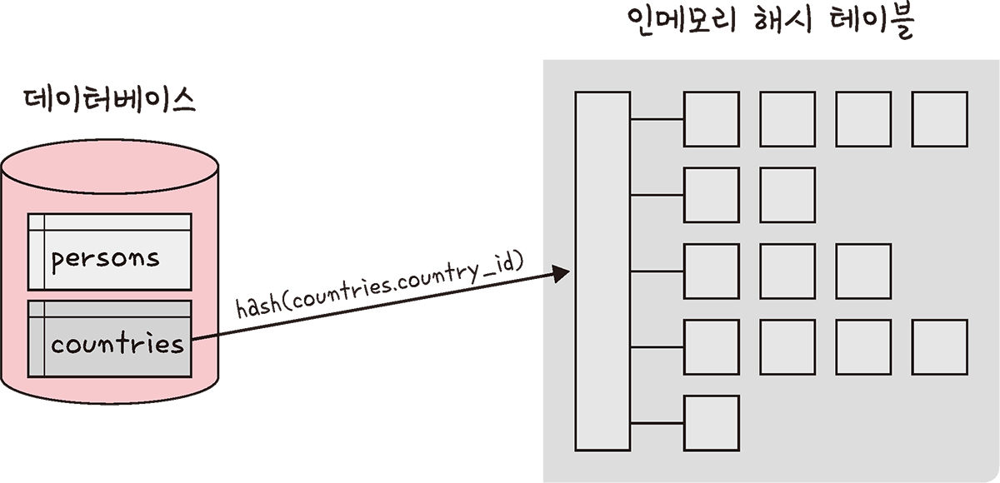
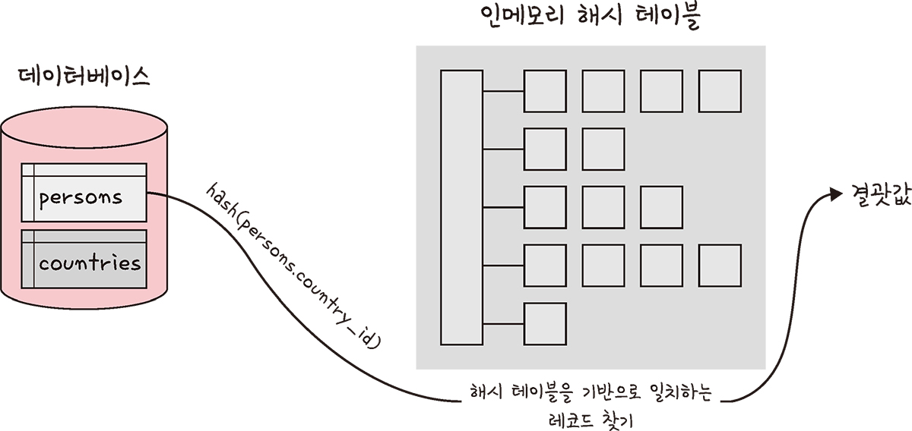

__조인의 원리__
===
조인의 원리를 기반으로 조인 작업이 이루어진다.

---
## __중첩 루프 조인(NLJ, Nested Loop Join)__
- 두 개의 테이블에서 하나씩 데이터를 읽으면서 조건에 맞는 데이터를 찾는 방법이에요. 마치 중첩된 for문처럼 작동
- 데이터 양이 많으면 성능이 저하되서 대용량 테이블에서는 잘 사용하지 않는다.
```sql
for each row in i1 matching reference key {
    for each row in i2 matching reference key {
        if row satisfies join conditions, send to client
    }
}
```

- 중첩 루프 조인의 한 형태로, 테이블을 작은 블록으로 나눠서 각 블록을 순차적으로 조인하는 방식인 블록 중첩 루프 조인(Block Nested Loop)이라는 방식도 있다.
---
## __정렬 병합 조인 (Sort-Merge Join)__
- 두 테이블을 조인할 필드 기준으로 먼저 정렬해요. 정렬이 끝난 후에 조인 작업을 수행
- 적절한 인덱스가 없고, 대용량 테이블을 조인할 때, 또는 범위 비교(<, >)가 필요한 경우에 사용
---
## __해시 조인 (Hash Join)__
- 해시 테이블을 이용해 조인하는 방법
- 메모리에 하나의 테이블이 완전히 들어갈 수 있다면, 중첩 루프 조인보다 더 빠르게 작업할 수 있다.
- 주로 동등(=) 조인에서 사용
- 해시 조인 단계는 빌드 단계, 프로브 단계로 나뉜다.

### __빌드 단계__
- 입력 테이블 중 하나를 기반으로 메모리 내 해시 테이블을 빌드하는 단계
- 일반적으로 바이트 크기가 더 작은 테이블을 기준으로 해시 테이블을 만든다.



### __프로브 단계__
- 레코드를 읽으면서, 해시 테이블에서 일치하는 데이터를 찾아서 결과로 반환
- 각 테이블은 한 번만 읽게 되므로, 성능이 일반적으로 더 좋다.



---
## __정리__
조인 방법은 데이터의 양이나 상황에 따라 다르게 선택할 수 있다.

중첩 루프 조인은 간단하지만 성능이 떨어지고, 정렬 병합 조인은 정렬 후 조인, 해시 조인은 메모리를 효율적으로 사용해 빠르게 조인하는 방법