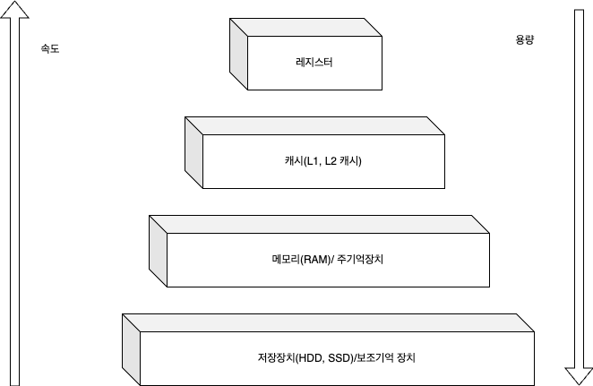
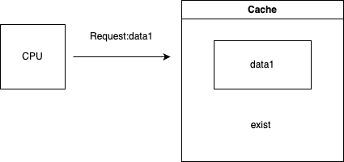

아래는 메모리 계층 및 관련 개념을 마크다운 언어로 정리한 내용입니다:

---

# 메모리 계층

메모리 계층은 레지스터, 캐시, 저장장치로 구성됩니다.

## 메모리 계층 구조의 필요성

- **속도와 비용의 차이**: 컴퓨터 메모리는 성능과 비용 측면에서 다양한 요구를 충족시켜야 합니다. 빠르고 접근이 쉬운 메모리는 가격이 높고 용량이 제한적이며, 대용량 메모리는 상대적으로 저렴하지만 속도가 느립니다. 이러한 다양한 메모리 기술의 조합을 통해, 컴퓨터 시스템은 속도와 비용, 용량 간의 균형을 맞출 수 있습니다.
- **메모리 계층**: 이러한 이유로 메모리 계층 구조가 필요합니다. 메모리 계층 구조는 속도와 비용에 따라 메모리를 계층적으로 배치하여, 자주 사용하는 데이터를 빠르게 접근할 수 있는 고속 메모리에 저장하고, 덜 자주 사용하는 데이터는 느리지만 대용량인 메모리에 저장하는 방식입니다.

## 메모리 계층 구조 (Memory Hierarchy)

- **레지스터**:
    - CPU 내부에 위치하며, 가장 빠르고 작은 용량의 메모리입니다.
    - **액세스 시간**: 나노초(ns) 단위

- **캐시 메모리 (SRAM)**:
    - CPU와 주 메모리(DRAM) 사이에 위치하며, 자주 사용하는 데이터를 저장합니다.
    - **L1, L2, L3 캐시**로 나뉘며, 각각 CPU에 더 가깝거나 멀리 위치해 액세스 속도에 차이가 있습니다.

- **주 메모리 (DRAM)**:
    - 컴퓨터의 메인 메모리로, 현재 실행 중인 프로그램과 데이터를 저장합니다.
    - **액세스 시간**: 마이크로초(µs) 단위

- **보조 기억 장치 (SSD, HDD)**:
    - DRAM보다 훨씬 큰 용량을 제공하지만, 속도는 더 느립니다.
    - **액세스 시간**: 밀리초(ms) 단위

## 메모리 계층의 원리

### 시간 지역성 (Temporal Locality)

- **정의**: 데이터나 프로그램 코드가 반복적으로 사용될 가능성이 높다는 개념입니다.
- **캐시 메모리 활용**: CPU 캐시 메모리는 자주 접근하는 데이터를 저장하여 시간 지역성을 활용합니다. 데이터가 한 번 참조되면, 가까운 미래에 다시 참조될 가능성이 높기 때문에, 자주 사용하는 데이터를 캐시에 저장하여 빠른 접근 속도를 유지합니다.
- **효율성**: 시간 지역성을 활용함으로써 캐시는 CPU의 데이터 접근 시간을 줄여 전체 시스템 성능을 향상시킵니다.

### 공간 지역성 (Spatial Locality)

- **정의**: 데이터가 메모리에서 연속된 주소 공간에 위치할 가능성이 높다는 개념입니다.
- **MOS 메모리와 활용**:
    - **페이지 테이블과 DRAM**: DRAM의 데이터는 페이지 단위로 저장되고 페이지 테이블을 통해 관리됩니다. 연속된 메모리 블록을 읽거나 쓸 때, DRAM의 페이지를 한 번에 로드하여 공간 지역성을 활용합니다.
    - **캐시 라인**: 캐시 메모리(SRAM)에서는 캐시 라인 단위로 데이터를 로드하여 공간 지역성을 활용합니다. 연속된 메모리 주소의 데이터가 포함된 캐시 라인으로 성능을 개선합니다.

## 시간 지역성과 공간 지역성의 예시

1. **시간 지역성 예시**:
    - **루프 실행**: 프로그램에서 루프가 반복 실행될 때, 루프 내의 변수나 배열 요소는 반복적으로 접근됩니다. 이 경우, 시간 지역성을 활용하여 캐시에 데이터를 저장하고 반복적인 접근 속도를 향상시킵니다.

2. **공간 지역성 예시**:
    - **배열 접근**: 배열을 순차적으로 탐색할 때 데이터는 연속된 메모리 주소에 저장됩니다. 이 경우, 공간 지역성을 활용하여 인접한 메모리 블록을 한 번에 로드하여 성능을 개선합니다.

## 캐시 히트(Cache Hit)와 캐시 미스(Cache Miss)

- **캐시 히트**: CPU가 요청한 데이터가 캐시에 존재하는 경우. 데이터는 캐시에서 직접 읽어지며, 메인 메모리(DRAM)에서 읽어오는 것보다 훨씬 빠릅니다.

- **캐시 미스**: CPU가 요청한 데이터가 캐시에 존재하지 않는 경우. 데이터는 메인 메모리에서 읽어와야 하며, 이 과정이 시간이 더 걸립니다. 캐시 미스가 발생하면 캐시는 데이터를 메인 메모리에서 읽어와 저장하고, 이후의 접근을 위해 데이터를 캐시에 로드합니다.

## 캐시 매핑(Cache Mapping)

캐시 매핑은 메모리 주소를 캐시의 특정 위치에 매핑하는 방법을 의미합니다. 주요 캐시 매핑 방식으로는 직접 매핑 (Direct Mapping), 연관 매핑 (Associative Mapping), 집합 연관 매핑 (Set-Associative Mapping)이 있습니다.

- **직접 매핑 (Direct Mapping)**:
    - **작동 방식**: 각 메모리 블록은 캐시의 특정 위치에만 저장될 수 있습니다. 메모리의 특정 주소는 캐시의 특정 라인에만 매핑됩니다.
    - **장점**: 구조가 간단하여 빠르게 동작합니다.
    - **단점**: 데이터가 자주 덮어쓰여 캐시 미스가 발생할 수 있습니다.

- **연관 매핑 (Associative Mapping)**:
    - **작동 방식**: 메모리 블록이 캐시의 어느 위치에나 저장될 수 있습니다. 메모리 블록이 캐시의 모든 위치를 검색하여 저장됩니다.
    - **장점**: 데이터 충돌이 줄어들고 캐시 히트율이 높습니다.
    - **단점**: 구현이 복잡하고 데이터 검색 시간이 더 걸립니다.

- **집합 연관 매핑 (Set-Associative Mapping)**:
    - **작동 방식**: 캐시가 여러 세트로 나뉘고, 각 세트는 연관 매핑 방식을 사용합니다. 메모리 블록이 특정 세트 내의 여러 위치 중 하나에 저장됩니다.
    - **장점**: 데이터 충돌을 줄이면서도 연관 매핑의 유연성을 제공합니다.
    - **단점**: 직접 매핑보다는 복잡하지만 연관 매핑보다는 간단합니다.

## 캐싱 계층

- **정의**: 데이터베이스 시스템에서 데이터 액세스 성능을 개선하기 위해 사용하는 여러 캐시 기술을 의미합니다. 데이터베이스는 많은 양의 데이터를 처리하고 저장하는 복잡한 시스템으로, 캐싱 계층은 데이터의 읽기 및 쓰기 속도를 높이고 데이터베이스의 부하를 줄이는 데 중요한 역할을 합니다. (예: Memcached, Redis 등 인메모리 저장 시스템의 캐시 서버로 사용됩니다.)

- **인메모리**: 데이터를 주 메모리(RAM)에서 직접 저장하고 처리하는 방법입니다.

---

**좀 더 자세한 사항을 알고 싶으면** https://minjooig.tistory.com/115
