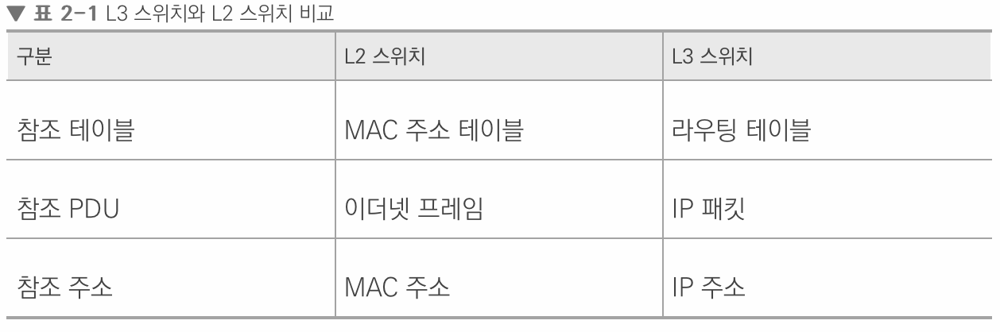

# 네트워크 기기

네트워크는 여러 개의 네트워크 기기를 기반으로 구축됩니다. 그리고 상위 계층을 처리하는 기기는 하위 계층을 처리할 수 있지만 그 반대는 불가능합니다.
 
네트워크 기기 종류

-   애플리케이션 계층: L7스위치
-   인터넷 계층: L3 스위치, 라우터
-   데이터 링크 계층: L2 스위치, 브리지
-   물리 계층: NIC, 리피터, AP

## 애플리케이션 계층을 처리하는 기기

### L7 스위치

스위치란 여러 장비를 연결하고 데이터 통신을 중재하며 목적지가 연결된 포트로만 전기 신호를 보내 데이터를 전송하는 통신 네트워크 장비입니다.

 

L7 스위치는 로드밸러서라고도 하며, 서버의 부하를 분산하는 기기입니다. 클라이언트로부터 오는 요청들을 뒤쪽의 여러 서버로 나누는 역할을 하며 시스템이 처리할 수 있는 트래픽 증가를 목표로 합니다.

L7 스위치는 URL, 서버, 쿠키들을 기반으로 트래픽을 분산합니다. 또한 바이러스, 불필요한 외부 데이터 등을 걸러내는 필터링 기능도 가지고 있으며 응용 프로그램 수준의 트래픽 모니터링도 가능합니다.

 

정기적으로 헬스 체크를 통해 장애가 있는 서버가 있다면 트래픽 분산 대상에서 제외합니다.

 

위 사진은 로드밸런서가 서버에 장애가 있을때 다른 서버로 트래픽을 분산하는 것을 그림으로 보여줬습니다.

 
 

헬스 체크: 전송 주기와 재전송 횟수등을 설정할 이후 반복적으로 서버에 요청을 보내는 것을 말합니다.

 

## 인터넷 계층을 처리하는 기기

### 라우터

라우터는 여러 개의 네트워크를 연결, 분할, 구분시켜주는 역할을 하며 "다른 네트워크에 존재하는 장치끼리 서로 데이터를 주고받을 때 패킷 소모를 최소화하고 경로를 최적화하여 최소 경로로 패킷을 포워딩"하는 라우팅을 하는 장비입니다.

> 추가 설명  
> 라우터는 라우팅기능이 있는 장비를 라우터라고 합니다.
>
> > 라우팅이란  
> > 간단하게 IP를 찾아가는 과정을 의미합니다.

### L3 스위치

L3 스위치란 L2 스위치의 기능과 라우팅 기능을 갖춘 장비를 말합니다. 즉, L3스위치를 라우터라고 해도 무방합니다.

 
 

## 데이터 링크 계층을 처리하는 기기

### L2 스위치

L2 스위치: 장치들의 MAC주소를 MAC주소 테이블을 통해 관리하며, 연결된 장치로부터 패킷이 왔을 때 패킷 전송을 담당합니다.

### 브리지

브리지: 두 개의 근거리 통신망(LAN)을 상호 접속할 수 있도록 하는 통신망 연결 장치로, 포트와 포트 사이의 다리 역할을 하며 장치에서 받아온 MAC 주소를 MAC 주소 테이블로 관리합니다. 통신망을 확장하고 서로 다른 LAN 등으로 이루어진 '하나의' 통신망을 구축할 때 쓰입니다.

## 물리 계층을 처리하는 기기

### NIC

LAN 카드라고 하는 네트워크 인터페이스 카드(NIC: Network Interface Card)는 2대 이상의 컴퓨터 네트워크를 구성하는 데 사용하며, 네트워크와 빠른 속도로 데이터를 송수신 할 수 있도록 컴퓨터 내에 설치하는 확장 카드입니다. 즉, 요즘에는 거의 모든 컴퓨터가 인터넷과 연결되어 있음으로 대부분 NIC 카드가 있습니다.

### 리피터

리피터: 들어오는 약해진 신호 정도를 증폭하여 다른 쪽으로 전달하는 장치를 말합니다.
하지만 현재는 광케이블이 보급되어 잘 쓰이지 않는 장치입니다.

### AP

AP(Access Point): 패킷을 복사하는 기기입니다. AP에 유선 LAN을 연결한 후 다른 장치에서 무선 LAN기술을 사용하여 무선 네트워크 연결을 할 수 있습니다.

 
 
 

# IP주소

## ARP

ARP(Address Resolution Protocol): IP주소로부터 MAC 주소를 구하는 IP와 MAC주소의 다리 역할을 하는 프로토콜입니다.

## 홉바이홉 통신

IP주소를 통해 통신하는 과정을 홉바이홉 통신이라고 합니다. 홉이란 건너뛰는 모습을 의미합니다.(통신망에서 각 패킷이 여러 개의 라우터를 건너가는 모습을 비유적으로 표현한 것입니다.)

통신 장치에 있는 라우팅테이블의 IP를 통해 시작 주소부터 시작하여 다음 IP로 계속해서 이동하는 라우팅 과정을 거쳐 패킷이 최종 목적지까지 도달하는 통신을 말합니다.
 

> 라우팅 테이블이란
>
> > 송신지에서 수신지까지 도달하기 위해 사용되며 라우터에 들어가 있는 목적지 정보들과 그 목적지로 가기 위한 바업ㅂ이 들어 있는 리스트

> 게이트웨이
>
> > 서로 다른 통신망, 프로토콜을 사용하는 네트워크 간의 통신을 가능하게 하는 관문 역할을 하는 컴퓨터나 소프트웨어를 두루 일컫는 용어입니다.

 

## IP 주소 체계

IP 주소는 IPv4와 IPv6로 나뉩니다. IPv4는 32비트를 8비트 단위로 점을 찍어 표기합니다.

 

# 클래스 기반 할당 방식

IP 주소는 현재 A, B, C, D, E 다섯 개의 클래스로 구분하는 클래스 기반 할당 방식을 사용합니다. 앞에 있는 부분을 네트워크 주소, 그 뒤에 있는 부분을 컴퓨터에 부여하는 주소인 호스트 주소로 놓아서 사용합니다.

### DHCP

DHCP는 IP주소 및 기타 통신 매개변수를 자동으로 할당하기 위한 네트워크 완리 프로토콜입니다. 이 기술을 통해 네트워크 장치의 IP주소를 수동으로 설정할 필요 없이 인터넷에 접속할 때마다 자동으로 IP주소를 할당할 수 있습니다.

 

### NAT

NAT(Network Address Translation)는 패킷이 라우팅 장치를 통해 전송되는 동안 패킷의 IP 주소 정보를 수정하여 IP 주소를 다른 주소로 매핑하는 방법입니다. IPv4 주소 체계만으로는 많은 주소들을 모두 감당하지 못하는 단점이 있는데, 이를 해결하기 위해 NAT로 공인 IP와 사설 IP로 나눠서 많은 주소를 처리합니다.

NAT를 쓰는 이유는 주로 여러 대의 호스트가 하나의 공인 IP 주소를 사용하여 인터넷에 접속하기 위함입니다. NET의 장점은 NAT를 이용하면 내부 네트워크에서 사용하는 IP 주소와 외부에 드러나는 IP 주소를 다르게 유지할 수 있기 때문에 내부 네트워크에 대한 어느 정도의 보안이 가능해집니다. 하지만 NAT는 여러 명이 동시에 인터넷을 접속하게 되므로 실제로 접속하는 호스트 숫자에 따라서 접속 속도가 느려질 수 있다는 단점이 있습니다.
