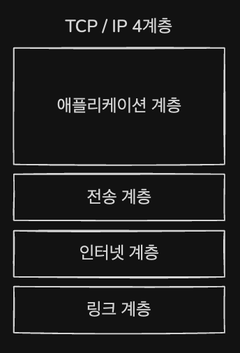
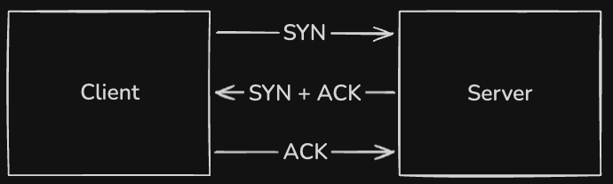
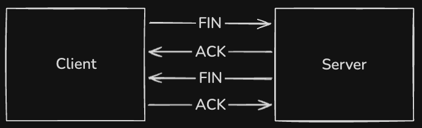
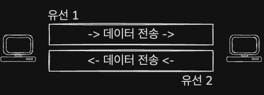
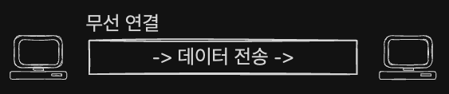
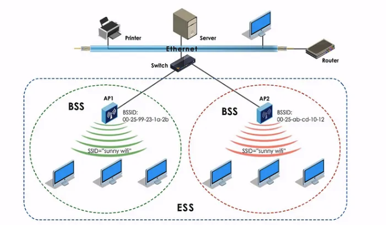
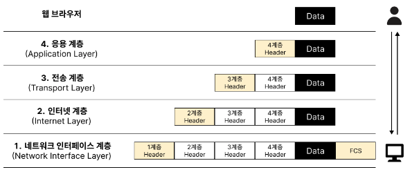

# TCP / IP 4 계층

데이터 통신에 필요한 로직대로 설계된 OSI 7 계층과 달리 TCP/IP 4계층은 인터넷 프로토콜 중심으로 각 계층들은 프로토콜의 네트워킹 범위에 따라 네 개의 추상화 계층으로 구성된다.

## 1. 애플리케이션 계층
- FTP &rarr; 장치 간의 파일을 전송하는 데 사용되는 통신 프로토콜

- HTTP &rarr; 네트워크 서비스를 안전하게 운영하기 위한 네트워크 암호화 프로토콜
- SSH &rarr; 웹 사이트를 이용하는 데 쓰는 프로토콜
- SMTP &rarr; 전자 메일 전송을 위한 프로토콜
- DNS &rarr; 도메인 이름과 IP 주소를 매핑해주는 서버

이와 같은 응용 프로그램이 사용되는 프로토콜 계층으로 `웹 서비스`, `이메일` 등 서비스를 유저들에게 제공하는 층이다.

## 2. 전송 계층
송신자와 수신자를 연결하는 통신 서비스를 제공하며 연결 지향 데이터 스트림 지원, 신뢰성, 흐름 제어를 제공할 수 있으며 애플리케이션과 인터넷 계층 사이의 데이터가 전달될 때 중계 역할을 한다.
### 대표적인 프로토콜
- TCP
    - 패킷 사이의 순서를 보장하고 연결지향 프로토콜을 사용하며 `신뢰성`을 구축하여 수신 여부 확인하는 방식인 `가상회선 패킷 교환 방식`을 사용한다.
- UDP
    - 순서를 보장하지 않고 수신 여부를 확인하지 않으며 데이터만 주는 `데이터그램 패킷 교환 방식` 을 사용한다.

---
### 패킷 교환 방식

- 가상회선 패킷 교환 방식
    
    모든 패킷이 `동일한 경로`를 통해 목적지까지 전송되며, 처음 설정된 `경로가 고정`된다. 이를 통해 모든 패킷이 동일한 경로로 전송되므로 `순서가 보장`되고 데이터의 `전송 안전성이 높아`진다.

- 데이터그램 패킷 교환 방식

    패킷이 목적지 까지 `최적의 경로를 선택`하며 `독립적으로 이동`한다. 따라서 패킷의 `순서는 다를 수 있다.` 
---

### TCP 의 신뢰성 구축 방법
- 연결 시

    데이터 전송 시 TCP 는 신뢰성을 구축하는데 `3 Way Handshake` 를 이용한다. 
    
    처음에 SYN 패킷을 보내고 이에 요청 승인에 대한 ACK 플래그가 설정된 패킷을 클라이언트에게 보낸다.

    마지막으로 클라이언트도 응답에 대한 승인 플래그 ACK 가 설정된 패킷을 서버에게 보내며 신뢰성 구축이 이뤄진다.

- 해제 시

    연결 해제 시엔 `4 Way Handshake` 를 이용한다. 

    클라이언트가 연결 해제 요청인 FIN 을 서버에게 보내면 서버는 ACK 승인 패킷을 보내고 일정 시간 이후 FIN 세그먼트를 보낸다. 

    마지막으로 클라이언트는 ACK 를 보내서 서버는 CLOSED 상태가 된다.

# 3. 인터넷 계층

- IP 
- ARP

    - ip 주소에 대응하는 MAC 주소를 변환하는 프로토콜
- ICMP

    - 오류 메시지를 보내 알리는 기능이다.

장치로부터 받은 네트워크 패킷을 IP 주소로 지정된 목적지까지 전송하기 위해 사용되는 계층이다.
상대방이 데이터를 제대로 받았는지에 대해 보장하지 않는 비연결형적인 특징을 지니고 있다.

# 4. 링크 계층
전선, 광섬유, 무선 등 연결을 통해 데이터를 전달하며 장치 간에 신호를 주고받는 규칙을 정하는 계층이다.
이를 물리 계층과 데이터 링크 계층으로 나누기도 한다. 

## 4.1 물리 계층

### 유선
- 전이중화 통신
    
    - 양쪽 장치가 동시에 송수신할 수 있는 방식을 말한다. 송신로와 수신로로 나눠서 데이터를 같이 주고받을 수 있으며 현대의 고속 이더넷 방식이다.
    

### 무선
- 반이중화 통신

    - 양쪽 장치끼리 서로 통신할 수 있지만, 전이중화 통신처럼 동시에 통신할 수 없고 한 번에 한 방향만 통신할 수 있는 방식이다.

    

- BSS (Basic Service Set)

    기본 서비스 집합을 의미하며, 동일한 BSS 내에 있는 장치들이 서로 통신이 가능한 구조를 말한다. 근거리 무선 통신을 제공한다.

- ESS (Extended Service Set)

    하나 이상으로 연결된 BSS 그룹이며 장거리 무선 통신을 제공하고 BSS 보다 더 많은 가용성과 이동성을 지원한다. 

    

    [이미지 출처](https://medium.com/networks-security/wireless-lan-wap-bss-bssid-ssid-ess-essid-5de3a81957f0)

---
## 계층 간 데이터 송수신 과정

[이미지 출처](https://brunch.co.kr/@danni/24)

계층끼리 송수신할 때 각 계층의 Header를 붙이는 캡슐화 과정과 제거하는 비캡슐화 과정을 거치며 데이터가 전달된다. 

- PDU 

    각 계층마다 데이터가 전달될 때 한 덩어리 단위를 PDU(Protocol Data Unit) 이라고 한다. 

    제어관련 정보들이 포함된 헤더와 데이터를 의미하는 페이로드로 구성되어 있다.