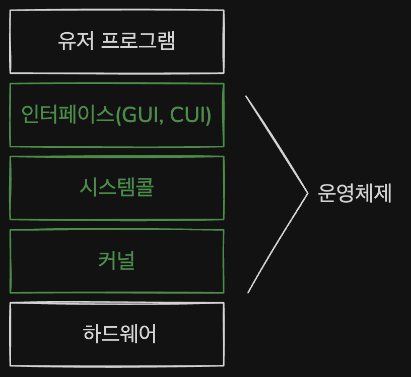
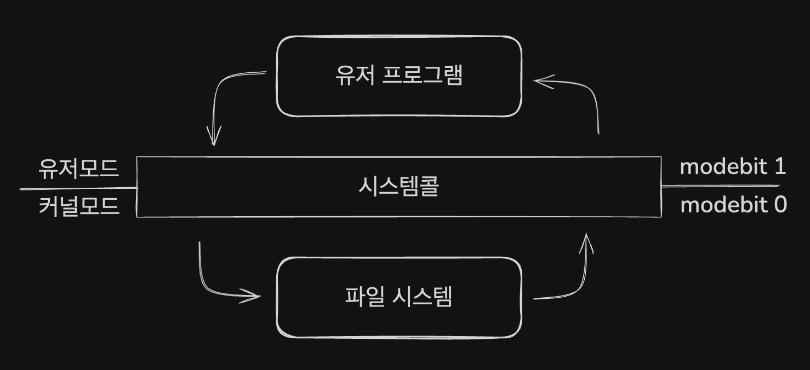

# 운영체제의 역할과 구조

## 운영체제의 역할 
1. CPU 스케줄링과 프로세스 관리
    > 프로세스 생성과 삭제, 프로세스 할당 및 반환을 관리

2. 메모리 관리
    > 한정된 메모리를 어떤 프로세스에 얼만큼 할당해야 하는지 관리

3. 디스크 파일 관리
    > 디스크 파일을 어떤 방법으로 보관할지 관리

4. I/O 디바이스 관리 
    > 마우스, 키보드와 컴퓨터 간에 데이터를 주고 받는 것을 관리

 

---
## 시스템콜
운영체제가 커널에 접근하기 위한 인터페이스이며 유저 프로그램이 운영체의 서비스를 받기 위해 `커널 함수` 를 호출할 때 사용

유저 프로그램이 I/O 요청으로 트랩을 발동하면 올바른 I/O 요청인지 확인한 후 유저모드가 시스템콜을 통해 커널 모드로 변환되어 실행됨.

> 유저모드 - 유저가 접근할 수 있는 영역을 제한한 모드
>
> 커널 모드 - 컴퓨터의 모든 자원에 접근할 수 있는 모드 

프로그램에서 운영체제에 대한 I/O 요청이 들어왔을 때 `시스템콜`을 통해 `커널모드`에서 요청을 수행하기 때문에 컴퓨터 자원에 대한 `직접적인 접근을 차단`할 수 있으며 프로그램을 다른 프로그램으로부터 보호할 수 있음.

### modebit
> I/O 요청에 대한 유저모드와 커널모드의 전환을 할 때 `modebit` 이라는 `플래그 변수` 를 활용한다.
>
> `modebit` 이 1일 땐 `유저 모드`를 뜻하며 `modebit` 이 0 일땐 `커널 모드`를 의미한다.

# 컴퓨터의 요소

 

## CPU 
산술논리연산장치, 제어장치, 레지스터로 구성되어 있는 컴퓨터 장치를 말함. 
인터럽트에 의해 단순히 메모리에 존재하는 명령어를 해석해서 실행하는 장치

## DMA 컨트롤러
I/O 디바이스가 메모리에 직접 접근할 수 있도록 하는 하드웨어 장치
CPU에 너무 만흔 인터럽트 요청이 들어오기 때문에 CPU 부하를 막아주며 CPU 일을 부담하는 보조 장치 

## 인터럽트
어떠한 신호가 들어왔을 때 CPU를 잠시 정지시키는 것을 의미한다. 키보드, 마우스 등 IO 디바이스로 인한 인터럽트, 프로세스 오류 등으로 발생

- 하드웨어 인터럽트
    
    IO 디바이스에서 발생하는 인터럽트를 말함. (키보드, 마우스)

- 소프트웨어 인터럽트
    
    트랩이라고도 한다. 프로세스 오류 등으로 시스템콜을 호출할 때 발동.

## 디바이스 컨트롤러
IO 디바이스들의 작은 CPU 기능을 수행하며 각 디바이스에서 생긴 데이터를 임시 저장하기 위한 로컬 버퍼를 활용하며 작동한다. 

    