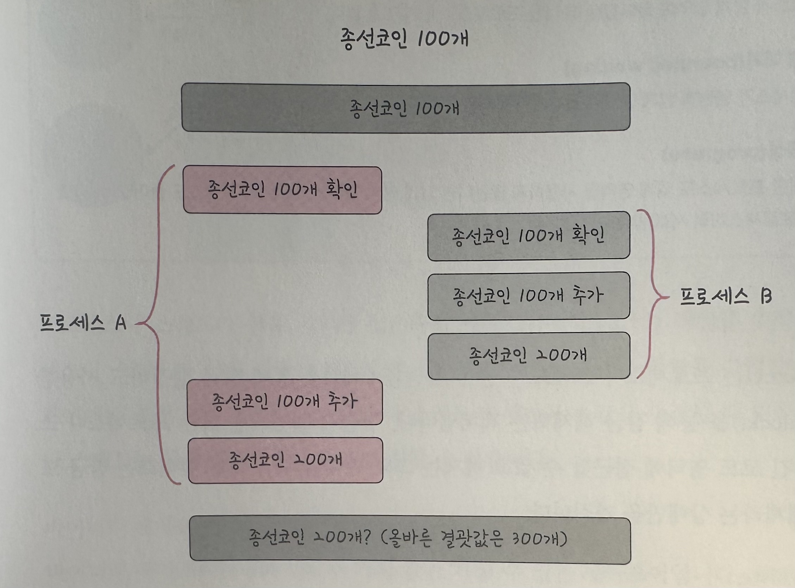
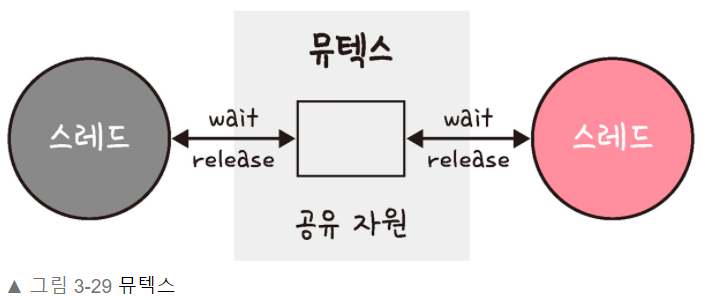
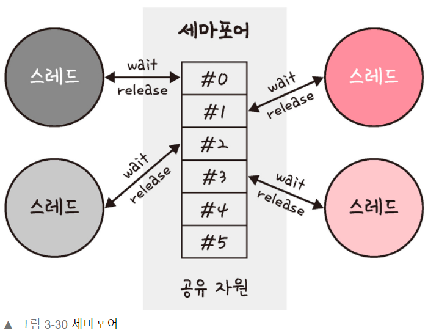
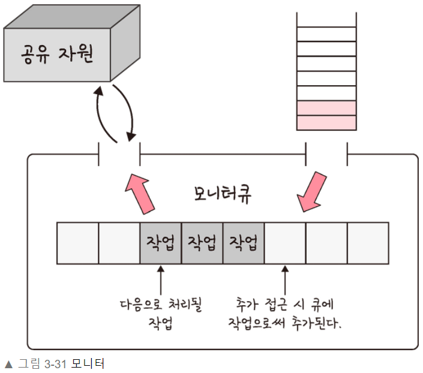

# 3.3.7 공유 자원과 임계 영역

> 우선 공유 자원과 임계 영역에 관해서 자세하게 알기 위해서는 스레드에 대해서 알아야합니다.  
> 스레드: 프로세스의 실행 가능한 가장 작은 단위로 프로세스는 멀티스레딩이라는 기술로 여러개의 스레드를 가집니다.  
> 이때 코드, 데이터, 스택, 힙을 각각 생성하는 프로세스와는 달리 스레드는 코드, 데이터, 힙을 스레드끼리 서로 공유해서 사용합니다.

### 공유 자원

공유 자원(shared resource): 시스템 안에서 각 프로세스, 스레드가 함께 접근할 수 있는 자원이나 변수등을 의미합니다. 공유 자원을 두 개 이상의 프로세스가 동시에 읽거나 쓰는 상황을 경쟁 상태라고 합니다.

위 사진과 같이 프로세스 A와 프로세스 A가 동시에 접근하여 타이밍이 서로 꼬이는 경우 300이 정상적인 결과값이지만 200이 출력될 수 있습니다.

 

## 임계 영역

임계 영역(critical section)은 둘 이상의 프로세스, 스레드가 공유 자원에 접근할 때 순서 등의 이유로 결과가 달라지는 코드 영역을 말합니다.(위에서 종선코인이 그런 부분입니다.) 임계 영역을 해결하기 위한 방법은 크게 뮤텍스, 세마포어, 모니터 세가지가 있습니다.
이 방법 모두 상호 배제, 한정대기, 융통성이란 조건을 만족합니다.
이 방법들 모두 장금 이라는 방법을 사용합니다.
잠금이란 한 프로세스나 스레드가 이 자원을 사용하면 잠금을 통해 다른 프로세스나 스레드가 사용하지 못하도록 막는 것을 의미합니다.

> 상호 배제(mutual exclusion)
>
> -   한 프로세스가 임계 영역에 들어갔을 때 다른 프로세스는 들어갈 수 없다.

> 한정 대기(counded waiting)
>
> -   특정 프로세스가 영원히 임계 영역에 들어가지 못하면 안된다.

> 융통성(progress)
>
> -   만약 어떠한 프로세스도 임계 영역을 사용하지 않는다면 임계 영역 외부의 어떠한 프로세스도 들어갈 수 있으며 이 때 프로세스끼리 서로 방해하지 않는다.

 

### 뮤텍스(mutex)

뮤텍스는 프로세스나 스레드가 공유 자원을 lock()을 통해 잠금 설정하고 사용한 후에는 unlock()을 통해 잠금 해제하는 객체입니다. 잠금이 설정되면 다른 프로세스나 스레드는 잠김 코드 여역에 접글할 수 없고, 해제는 그와 반대입니다. 또한 뮤텍스는 잠금 또는 잠금 해제라는 상태만을 가집니다.

 

 

### 세마포어

세마포어는 일반화된 뮤텍스입니다. 간단한 정수 값과 두 가지 함수 wait(P함수) 및 signal(V함수)로 공유 자원에 대한 접근을 처리합니다.
wait()는 자신의 차례가 올 때까지 기다리는 함수이며, signal()은 다음 프로세스로 순서를 넘겨주는 함수입니다.

 

 

프로세스나 스레드가 공유 자원에 접근하면 세마포어에서 wait() 작업을 수행하고 프로세스나 스레드가 공유 자원을 해제하면 세마포어에서 signal() 작업을 수행합니다. 세마포어에는 조건 변수가 없고 프로세스나 스레드가 세마포어 값을 수정할 때 다른 프로세스나 스레드는 동시에 세마포어 값을 수정할 수 없습니다.

#### 바이너리 세마포어

바이너리 세마포어는 0과 1의 두 가지 값만 가질 수 있는 세마포어입니다. 뮤텍스는 바이너리 세마포어라고 할 수 있지만 뮤텍스는 잠금을 기반으로 상호배제가 일어나는 '잠금 메커니즘'이고, 세마포어는 신호를 기반으로 상호 배제가 일어나는 '신호 메커니즘'이다.
신호 메커니즘은 휴대폰에서 노래를 듣다가 친구로부터 전화가 오면 노래가 중지되고 통화 처리 작업에 관한 인터페이스가 등장하는 것과 비슷합니다.

#### 카운팅 세마포어

카운팅 세마포어는 여러 개의 값을 가질 수 있는 세마포어이며, 여러 자원에 대한 접근을 제어하는 데 사용됩니다.

 

### 모니터

모니터는 둘 이상의 스레드나 프로세스가 공유 자원에 안전하게 접근할 수 있도록 공유자원을 숨기고 해당 접근에 대해 인터페이스만 제공합니다.

 

 

모니터는 모니터큐를 통해 공유 자원에 대한 작업드를 순차적으로 처리합니다.
모니터는 세마포어보다 구현하기 쉬우며 모니터에서 상호 배제는 자동인 반면에, 세마포어에서는 상호 배제를 명시적으로 구현해야 하는 차이점이 있습니다.
