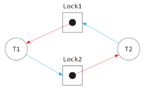

# 교착 상태

교착 상태(deadlock): 두 개 이상의 프로세스들이 서로가 가진 자원을 기다리며 중단된 상태를 말합니다.

 

 

## 교착 상태의 원인

-   상호 배제: 한 프로세스가 자원을 독점하고 있으며 다른 프로세스들은 접근이 불가능합니다.
-   점유 대기: 특정 프로세스가 점유한 자원을 다른 프로세스가 요청하는 상태입니다.
-   비선점: 다른 프로세스의 자원을 강제적으로 가져올 수 없습니다.
-   환형 대기: 프로세스 A는 프로세스 B의 자원을 요구하고, 프로세스 B는 프로세스 A의 자원을 요구하는 등 서로가 서로의 자원을 요구하는 상황을 말합니다.
     

 

## 교착 상태의 해결 방법

1. 자원을 할당할 때 애초에 조건이 성립되지 않도록 설계합니다.
2. 교착 상태 가능성이 없을 때만 자원 할당되며, 프로세스당 요청할 자원들의 최대치를 통해 자원 할당 가능 여부를 파악하는 '은행원 알고리즘'을 씁니다.
3. 교착 상태가 발생하면 사이클이 있는지 찾아보고 이에 관련된 프로세스를 한 개씩 지웁니다.
4. 교착 상태는 매우 드물게 일어나기 때문에 이를 처리하는 비용이 더 커서 교착상태가 발생하면 사용자가 작업을 종료합니다. 현대 운영체제는 이 방법을 채택했습니다.

> 은행원 알고리즘
> 총 자원의 양과 현재 할당한 자원의 양을 기준으로 안정 또는 불안정 상태로 나누고 안정 상태로 가도록 자원을 항당하는 알고리즘
